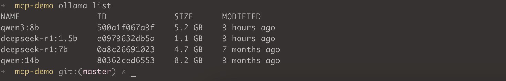
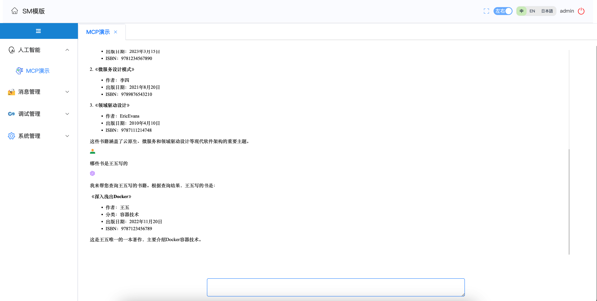

### 依赖
- JDK17
- Maven3.6.3

### 配置
- 方式1 使用deepseek

修改下 `application.yml` 中的`spring.ai.openai.api-key`

- 方式2 使用本地`ollama`部署的模型

下载个最新的版本，老的版本可能不支持 `tools`特性




### 启动
```text
mvn -DskipTests=true clean compile spring-boot:run
```

### 访问

http://localhost:8080/demo/hbq969-sm/index.html

### DEMO
