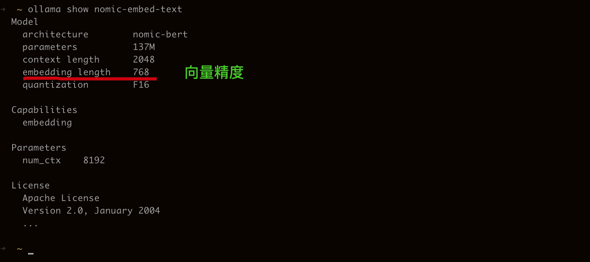
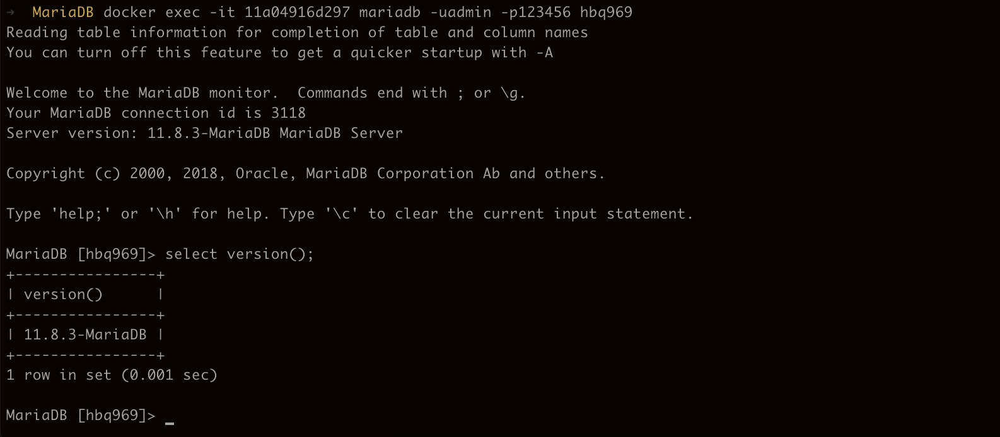

## MCP
### 必要依赖
- 支持`Tools`特性的模型, 参考 [Ollama官网](https://ollama.com/)
- JDK@17
- Maven@3.6.3

支持`Tools`特性的模型,比如下面
- [qwen3:8b](https://ollama.com/library/qwen3)

```bash
ollama pull qwen3:8b
```


### 配置
> 注意 `spring.ai.vectorstore.mariadb.dimensions` 需要配置为对应模型的向量精度,可通过`ollama show nomic-embed-text` 查看
```yaml
spring:
  datasource:
    type: com.zaxxer.hikari.HikariDataSource
    dynamic:
      enabled: true
      base-packages: com.github.hbq969
      default-lookup-key: hikari
    hikari:
      jdbc-url: jdbc:h2:file:${user.dir}/.h2/mcp/db;DB_CLOSE_DELAY=-1;AUTO_SERVER=TRUE
      driver-class-name: org.h2.Driver
      username: foo
      password: bar
      maximum-pool-size: 20
      minimum-idle: 5
      max-lifetime: 1800000
      connection-test-query: SELECT 1
    mariadb:
      jdbc-url: jdbc:mariadb://localhost:13306/hbq969
      driver-class-name: org.mariadb.jdbc.Driver
      username: admin
      password: 123456
      maximum-pool-size: 20
      minimum-idle: 5
      max-lifetime: 1800000
      connection-test-query: SELECT 1
  ai:
    ollama:
      base-url: http://localhost:11434
      chat:
        options:
          model: qwen3:8b
      embedding:
        model: nomic-embed-text
    mcp:
      server:
        enabled: true
        name: book-management-server
        version: 1.0.0
        type: sync
        instructions: |
          你是一个图书管理助手，必须优先使用以下工具查询图书：
          - findBooksByAuthor: 当用户询问作者相关图书时使用
          - findBooksByTitle: 当标题模糊匹配时使用
          - findBooksByCategory: 当涉及分类时使用
          回复时请整理为表格格式。
        capabilities:
          tool: true
          resource: true
          prompt: true
          completion: true
        sse-message-endpoint: /mcp/message
        stdio: false
        sse-endpoint: /sse
    vectorstore:
      mariadb:
        initialize-schema: true
        distance-type: cosine
        dimensions: 768
```



### 启动
```text
mvn -DskipTests=true clean compile spring-boot:run
```

### 演示
> [地址](http://localhost:8080/demo/hbq969-sm/index.html#/mcp)


## RAG

### 必要依赖
- 支持`Embedding`特性的模型, 参考 [Ollama官网](https://ollama.com/)
- JDK@17
- Maven@3.6.3
- 向量数据库 MariaDB@11.8-ubi9

支持Embedding特性的模型：
- [Q78KG/gte-Qwen2-7B-instruct:q8_0](https://ollama.com/Q78KG/gte-Qwen2-7B-instruct)
- [nomic-embed-text](https://ollama.com/library/nomic-embed-text)

```bash
ollama pull Q78KG/gte-Qwen2-7B-instruct:q8_0
ollama pull nomic-embed-text
```


### MariaDB安装
```bash
mkdir MariaDB && cd MariaDB
mkdir data
vi docker-compose.yml
```

```yaml
services:
  mariadb-vector:
    image: mariadb:11.8-ubi9
    container_name: mariadb-11.8-vector
    restart: unless-stopped
    environment:
      MARIADB_ROOT_PASSWORD: 123456
      MARIADB_DATABASE: hbq969
      MARIADB_USER: admin
      MARIADB_PASSWORD: 123456
    ports:
      - "13306:3306"
    volumes:
      - ./data:/var/lib/mysql
      - ./my.cnf:/etc/mysql/my.cnf:ro
      - /etc/localtime:/etc/localtime:ro
    healthcheck:
      test: >
         bash -c 'mariadb-admin ping --silent -u $$MARIADB_USER -p$$MARIADB_PASSWORD'
      interval: 10s
      retries: 3
      timeout: 5s
```

```bash
vi my.cnf
```

```ini
[mysqld]
character-set-server=utf8mb4
collation-server=utf8mb4_unicode_520_ci
innodb_buffer_pool_size=512M
innodb_file_per_table=1
log_bin=mysql-bin
binlog_format=row
default_authentication_plugin=mysql_native_password

# 启用向量索引特性（若有需要）
plugin_load_add=ha_vector
```

启动MariaDB
```bash
docker-compose up -d
```


验证MariaDB
```bash
docker exec -it 容器ID mariadb -uadmin -p123456 hbq969
```

```sql
SELECT VERSION();
```



### 配置、启动
同 `MCP`

### 演示
> [地址](http://localhost:8080/demo/hbq969-sm/index.html#/rag)

